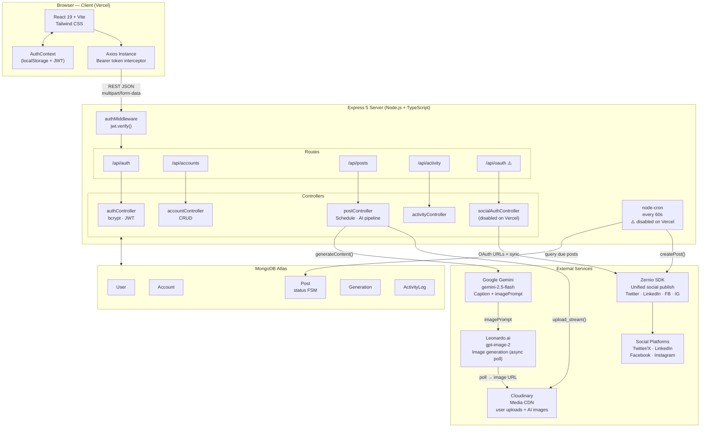
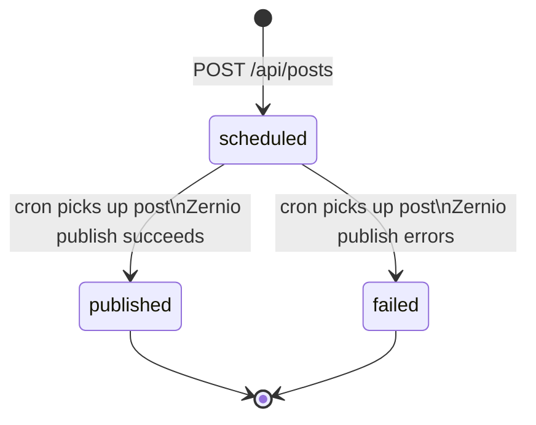
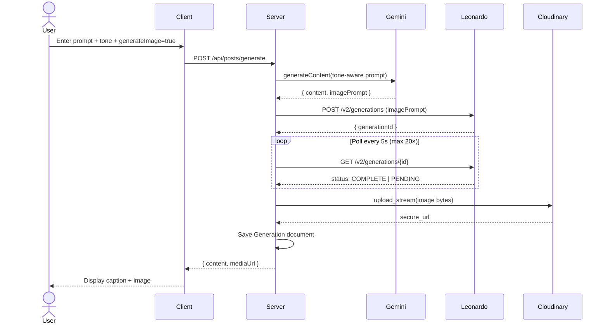

# SocialMediaAutomation

A full-stack MERN application for scheduling social media posts across multiple platforms, with AI-powered caption and image generation. Users compose content once, schedule it, and a background cron job publishes it to Twitter/X, LinkedIn, Facebook, and Instagram at the right time.

---

## Architecture Overview

The system uses a **layered monolith** architecture split into two independently-deployed applications.

### System Architecture



> **⚠️ Vercel note:** `node-cron` and the Zernio OAuth controller are disabled in the serverless build. Deploy the backend to Railway or Render to use post scheduling and OAuth account linking.

### Post Status State Machine



### AI Generation Pipeline



**Why this shape?** The domain is simple enough that a monolith avoids distributed-systems overhead. The frontend and backend are separated into distinct packages (`Client/` and `server/`) so they can be deployed independently to Vercel.

---

## Tech Stack

### Backend

| Technology | Version | Role & Why |
|---|---|---|
| Node.js + Express 5 | 5.2.1 | HTTP server. Express 5 adds async error propagation without try/catch wrappers. |
| TypeScript | 6.0.3 | Compile-time safety across models, controllers, and API contracts. |
| Mongoose | 9.6.3 | MongoDB ODM. Provides schema validation and typed document interfaces. |
| node-cron | 4.2.1 | In-process scheduler. Polls for due posts every 60 seconds without an external job queue. |
| bcrypt | 6.0.0 | Password hashing at 10 salt rounds — balances security with latency. |
| jsonwebtoken | 9.0.3 | Stateless auth tokens with 30-day expiry — no session store needed. |
| multer | 2.1.1 | Multipart form parsing. Configured for memory storage so files go straight to Cloudinary. |
| @google/genai | 2.8.0 | Google Gemini API SDK for caption generation. |
| @zernio/node | 0.2.209 | Unified social publishing abstraction across all supported platforms. |
| Cloudinary SDK | 2.10.0 | Cloud media storage and CDN delivery for both user uploads and AI-generated images. |

### Frontend

| Technology | Version | Role & Why |
|---|---|---|
| React | 19.2.6 | UI framework. Version 19 enables concurrent rendering features. |
| TypeScript | 6.0.3 | Type-safe component props and API response shapes. |
| Vite | 8.0.13 | Build tool. Faster HMR than webpack for TypeScript/React. |
| React Router DOM | 7.15.1 | Client-side routing with protected route wrappers. |
| Tailwind CSS | 4.3.0 | Utility-first styling — no CSS files to maintain. |
| Axios | 1.17.0 | HTTP client with request interceptors for JWT injection. |
| React Context API | built-in | Auth state (user, token, isAuthenticated) — avoids Redux for a simple single-concern store. |
| React Hot Toast | 2.6.0 | Non-blocking error/success notifications. |
| Lucide React + Simple Icons | — | UI icons and social platform brand icons. |

### External Services

| Service | Model / Version | Purpose |
|---|---|---|
| MongoDB Atlas | — | Hosted NoSQL database |
| Google Gemini | gemini-2.5-flash | AI text generation (captions, hashtags) |
| Leonardo.ai | gpt-image-2 (1024×1024) | AI image synthesis from text prompts |
| Cloudinary | v2 | Persistent media storage and CDN |
| Zernio | v0.2.209 | Unified social media publishing API |

---

## Data Flow — End to End

### Scheduling and Publishing a Post

```
User fills Scheduler form
        │
        ▼
POST /api/posts  (multipart/form-data)
        │
        ├─ multer buffers media file in memory
        ├─ Cloudinary upload_stream() → returns secure URL
        ├─ Post saved to MongoDB (status: "scheduled")
        └─ HTTP 201 returned

        [every 60 seconds]
        │
node-cron wakes up
        │
        ├─ Post.find({ status:"scheduled", scheduledFor:{ $lte: now } })
        ├─ For each due post:
        │    ├─ Account.find({ platform: {$in: post.platforms} })
        │    ├─ Call Zernio posts.createPost() with content + media
        │    ├─ SUCCESS → post.status = "published", create ActivityLog
        │    └─ FAILURE → post.status = "failed"
        │
Frontend polls GET /api/posts every 10 seconds
        └─ Scheduler page reflects updated status
```

### AI Content Generation

```
User enters prompt + tone + generateImage flag
        │
        ▼
POST /api/posts/generate
        │
        ├─ Build Gemini prompt:
        │    "Generate a [tone] social media post with hashtags.
        │     Return JSON: { content, imagePrompt }"
        ├─ Call gemini-2.5-flash → parse JSON response
        │
        ├─ [if generateImage=true]
        │    ├─ POST to Leonardo.ai /v2/generations with imagePrompt
        │    ├─ Poll Leonardo every 5s (max 20 retries / 100s)
        │    ├─ Download completed image
        │    └─ Re-upload to Cloudinary folder ai-generations/
        │
        ├─ Save Generation document (content, mediaUrl, tone, prompt)
        └─ Return { content, mediaUrl } to client
```

### Authentication Flow

```
Register/Login form
        │
        ▼
POST /api/auth/register or /login
        │
        ├─ bcrypt.compare() on login / bcrypt.hash(10) on register
        ├─ jwt.sign({ userId }, JWT_SECRET, { expiresIn: "30d" })
        └─ { token, user } returned

Client (AuthContext)
        ├─ Saves { token, user } to localStorage
        ├─ Sets Axios default header: Authorization: Bearer <token>
        └─ All subsequent requests carry the token automatically

Protected routes (server)
        └─ authMiddleware.ts: jwt.verify() → req.user = payload
```

---

## Key Modules

### Server

```
server/
├── server.ts              # Express app bootstrap, middleware, route mounting, scheduler init
├── config/
│   ├── db.ts              # mongoose.connect() to MongoDB Atlas
│   ├── cloudinary.ts      # Cloudinary SDK config (reads env vars)
│   ├── multer.ts          # memoryStorage() — no disk writes
│   └── zernio.ts          # Zernio SDK init (API key from env)
├── models/
│   ├── User.ts            # Identity (email, hashed password, zernioProfileId)
│   ├── Account.ts         # Connected social accounts (tokens, platform, handle)
│   ├── Posts.ts           # Scheduled post (content, platforms[], scheduledFor, status)
│   ├── Generation.ts      # AI generation history (prompt, caption, mediaUrl, tone)
│   └── ActivityLog.ts     # Audit trail (actionType, description, relatedPost)
├── middlewares/
│   └── authMiddleware.ts  # JWT verify → injects req.user
├── controllers/
│   ├── authController.ts          # register + login handlers
│   ├── accountControllers.ts      # CRUD for connected social accounts
│   ├── postController.ts          # Schedule posts, AI generation pipeline (~217 lines)
│   ├── socialAuthController.ts    # OAuth URL + Zernio sync (disabled on Vercel)
│   └── activityController.ts      # Retrieve last 10 activity logs
├── routes/                        # Express routers (thin — just mount controllers)
└── services/
    └── schedulerService.ts        # node-cron job: query + publish due posts
```

### Client

```
Client/src/
├── main.tsx               # React 19 entry: Router + AuthProvider wraps App
├── App.tsx                # Route table (public: /, /login; protected: /dashboard, /accounts, /schedule, /ai-composer)
├── api/
│   └── axios.ts           # Axios instance — injects Authorization header from localStorage token
├── context/
│   └── AuthContext.tsx    # user, token, isAuthenticated, login(), logout() — reads localStorage on mount
├── pages/
│   ├── Home.tsx           # Landing page (assembles 8 section components)
│   ├── Login.tsx          # Register/login toggle form
│   ├── Dashboard.tsx      # Aggregated stats + activity feed
│   ├── Accounts.tsx       # Connect/disconnect social accounts
│   ├── Scheduler.tsx      # Compose form + live post list with 10s polling
│   └── AIComposer.tsx     # Prompt form, tone picker, generation history grid
├── components/
│   ├── Layout.tsx         # Protected route wrapper → redirects to /login if unauthenticated
│   ├── Sidebar.tsx        # Navigation links + user profile footer
│   ├── AccountList.tsx    # Account cards with connect/disconnect actions
│   ├── PlatformPickerModel.tsx  # Modal for selecting target platforms
│   └── Home/              # 8 landing page sections (Navbar, Hero, Features, HowItWorks, Testimonials, Pricing, CTA, Footer)
└── assets/
    └── assets.tsx         # Platform definitions (id, label, icon), static dummy data for development
```

---

## Database & Storage

### MongoDB (via Mongoose on Atlas)

All business data lives in MongoDB. No relational joins — Mongoose `populate()` handles references.

**Document schemas:**

| Model | Key Fields | Purpose |
|---|---|---|
| `User` | email, password (hashed), name, zernioProfileId | Identity and Zernio mapping |
| `Account` | user (ref), platform (enum), handle, zernioAccountId, accessToken, refreshToken, status | Connected social accounts per user |
| `Post` | user (ref), content, platforms[], scheduledFor, status (draft/scheduled/published/failed), mediaUrl | The scheduling unit |
| `Generation` | user (ref), prompt, content, tone, mediaUrl | History of AI-generated content |
| `ActivityLog` | user (ref), actionType (POST_PUBLISHED/AI_REPLY), description, relatedPost (ref) | Audit trail for the dashboard |

**Platform enum values:** `twitter`, `linkedin`, `facebook`, `instagram`, `facebook_page`, `linkedin_page`, `instagram_business`

**Why MongoDB?** The schema varies by platform (Instagram requires media, Twitter has character limits, etc.). Document flexibility avoids schema migrations as new platforms are added.

### Cloudinary (Media Storage)

Cloudinary serves as the unified media layer for two distinct sources:

1. **User-uploaded files** — Scheduler form uploads flow through multer (memory buffer) → `cloudinary.uploader.upload_stream()` → Cloudinary CDN. The returned `secure_url` is stored on the Post document.

2. **AI-generated images** — Leonardo.ai images are downloaded in-process then re-uploaded to the `ai-generations/` Cloudinary folder. This ensures images persist beyond Leonardo's own retention window.

All `mediaUrl` fields in the database are Cloudinary URLs, regardless of origin.

---

## APIs & Integrations

### Internal REST API

All endpoints are prefixed `/api/` and respond with JSON (except `POST /api/posts` which uses `multipart/form-data`).

| Method | Route | Auth | Description |
|---|---|---|---|
| POST | `/api/auth/register` | No | Create account |
| POST | `/api/auth/login` | No | Login, returns JWT |
| GET | `/api/accounts` | JWT | List user's connected accounts |
| POST | `/api/accounts` | JWT | Manually add an account |
| DELETE | `/api/accounts/:id` | JWT | Disconnect an account |
| GET | `/api/oauth/:platform/url` | JWT | Get OAuth redirect URL *(disabled on Vercel)* |
| GET | `/api/oauth/sync` | JWT | Sync accounts from Zernio *(disabled on Vercel)* |
| GET | `/api/posts` | JWT | List user's posts |
| POST | `/api/posts` | JWT | Schedule a post (multipart/form-data) |
| POST | `/api/posts/generate` | JWT | Generate AI caption + optional image |
| GET | `/api/posts/generations` | JWT | List AI generation history |
| GET | `/api/activity` | JWT | Get last 10 activity log entries |

### Authentication

**Mechanism:** JWT Bearer token

- Tokens are signed with `JWT_SECRET`, expire after 30 days.
- The client stores the token in `localStorage`; `AuthContext` hydrates it on page load.
- `api/axios.ts` sets `Authorization: Bearer <token>` as a default header after login.
- `authMiddleware.ts` calls `jwt.verify()` and attaches the decoded payload to `req.user`. All protected routes are mounted after this middleware.

### External Services

**Google Gemini (`@google/genai`)**
- Model: `gemini-2.5-flash`
- Called from `postController.ts` with a structured prompt that instructs the model to return strict JSON `{ content, imagePrompt }`.
- JSON-mode output eliminates regex parsing and makes the response contract explicit.

**Leonardo.ai**
- Called via raw `fetch` to the Leonardo REST API.
- The generation is asynchronous — Leonardo returns a `generationId` immediately. A custom polling loop retries every 5 seconds (up to 20 times / 100 seconds total) until `status === "COMPLETE"`.
- On completion, the image is downloaded and re-uploaded to Cloudinary.

**Zernio (`@zernio/node`)**
- Abstracts the different APIs of Twitter, LinkedIn, Facebook, and Instagram behind a single interface.
- `socialAuthController.ts` uses it to generate OAuth URLs and sync connected accounts.
- `schedulerService.ts` uses it to publish posts: `zernio.posts.createPost({ content, media, accountIds })`.
- **Currently disabled on Vercel** — Zernio requires persistent OAuth state that doesn't fit a stateless serverless environment. Uncomment in both files for deployments on Railway or Render.

**Cloudinary**
- Configured once in `config/cloudinary.ts` from env vars.
- Used in `postController.ts` (user uploads) and the Leonardo.ai polling block (AI image re-upload).
- Both use the streaming API (`upload_stream`) to avoid writing files to disk.

---

## Key Design Decisions

### 1. Post Status State Machine

Posts transition through a strict set of statuses: `draft → scheduled → published | failed`.

The cron job only queries for `status: "scheduled"` posts. When it picks one up, it updates the status to a terminal value before attempting publish. This prevents a second cron tick from double-publishing the same post if the first publish is slow or if the server restarts mid-run.

### 2. Polling Instead of WebSockets

The Scheduler page re-fetches `GET /api/posts` every 10 seconds. This is intentionally simple — WebSockets require a persistent server connection that conflicts with serverless deployment. Polling at 10-second intervals is imperceptible to users for a scheduling tool, and it works the same whether the backend is on Vercel or a long-lived server.

### 3. Cloudinary as the Universal Media Layer

Both user-uploaded files and AI-generated images are stored as Cloudinary URLs. The rest of the application (Post model, frontend renderer) never needs to know or care where a file came from — it's always a CDN URL with the same shape.

### 4. Gemini JSON-Mode Prompts

The Gemini prompt explicitly asks for a JSON object with `content` and `imagePrompt` fields. This decouples the text caption from the image generation prompt — a single LLM call feeds both the caption display and the Leonardo.ai request without any fragile string parsing.

### 5. Leonardo.ai Polling Inside the HTTP Request

Rather than storing the `generationId` and making the client poll, the entire Leonardo.ai async cycle (submit → poll → download → Cloudinary upload) runs inside a single `POST /api/posts/generate` request. The client makes one call and waits for the result. The trade-off is a potentially long HTTP response time (up to ~100 seconds worst case) for image generation.

### 6. Vercel Deployment Constraints

Two features are explicitly commented out for Vercel:
- **Zernio OAuth** — requires persistent token storage and redirect handling.
- **node-cron** — Vercel serverless functions are short-lived; an in-process cron job would never fire.

For a full-featured production deployment, the backend should run on a persistent server (Railway, Render, or a VPS). The comments in `socialAuthController.ts` and `server.ts` mark exactly what needs to be re-enabled.

### 7. Multer Memory Storage

Multer is configured with `memoryStorage()` — files never touch disk. The in-memory `Buffer` is piped directly to Cloudinary's upload stream. This avoids temporary file cleanup and works in serverless environments where the filesystem is ephemeral or read-only.

---

## Background Jobs

### `services/schedulerService.ts` — Post Publisher

```
Cron expression: * * * * *  (every minute)
```

1. Queries MongoDB for all posts with `status: "scheduled"` and `scheduledFor <= now`.
2. For each post, queries for connected `Account` documents matching the post's target platforms.
3. Calls `Zernio.posts.createPost()` with content, optional media URL, and account IDs.
4. On success: sets `post.status = "published"`, creates an `ActivityLog` entry.
5. On failure: sets `post.status = "failed"`.

The scheduler is initialized once at server startup in `server.ts` and runs in the same Node.js process. It is commented out in the Vercel deployment configuration.

---

## Error Handling & Logging

**Backend:**
- Controllers use `try/catch` and return structured JSON errors (`{ message: "..." }`) with appropriate HTTP status codes.
- Failed publish attempts set `post.status = "failed"` — no automatic retries.
- `console.error()` is used for server-side error logging (no structured logging library).

**Frontend:**
- Axios errors are caught in component event handlers.
- `react-hot-toast` displays non-blocking error and success notifications.
- 401 responses redirect to `/login`.

---

## Environment Variables

### Server (`server/.env`)

| Variable | Purpose |
|---|---|
| `MONGODB_URI` | MongoDB Atlas connection string |
| `JWT_SECRET` | Secret for signing/verifying JWT tokens |
| `ZERNIO_API_KEY` | Zernio SDK authentication key |
| `GEMINI_API_KEY` | Google Gemini API key |
| `LEONARDO_API_KEY` | Leonardo.ai API key |
| `CLOUDINARY_CLOUD_NAME` | Cloudinary account cloud name |
| `CLOUDINARY_API_KEY` | Cloudinary API key |
| `CLOUDINARY_API_SECRET` | Cloudinary API secret |

### Client (`Client/.env`)

| Variable | Purpose |
|---|---|
| `VITE_API_BASE_URL` | Base URL for backend API (`http://localhost:3000` in dev, production URL in prod) |

---

## Quick Start

**Prerequisites:** Node.js 18+, a MongoDB Atlas cluster, and API keys for Gemini, Leonardo.ai, Cloudinary, and Zernio.

```bash
# Backend
cd server
cp .env.example .env   # fill in your keys
npm install
npm run dev            # http://localhost:3000

# Frontend (separate terminal)
cd Client
echo "VITE_API_BASE_URL=http://localhost:3000" > .env
npm install
npm run dev            # http://localhost:5173
```

**Production build:**

```bash
# Backend
cd server && npm run build && npm start

# Frontend
cd Client && npm run build
# Serve dist/ from any static host, or deploy to Vercel
```

**Vercel note:** The frontend deploys as-is. For the backend on Vercel, Zernio and node-cron are disabled. To use full social publishing and scheduled post delivery, deploy the backend to Railway or Render instead and re-enable the commented-out sections in `server.ts` and `socialAuthController.ts`.
